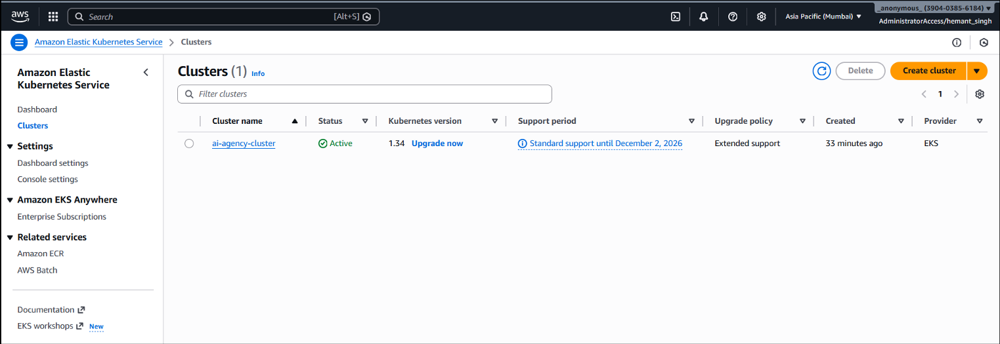
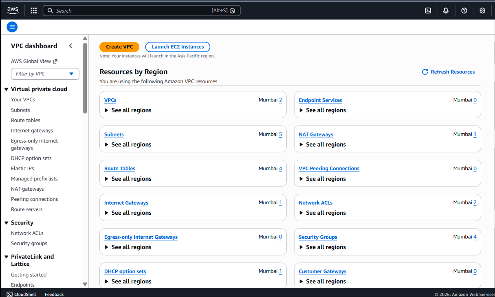
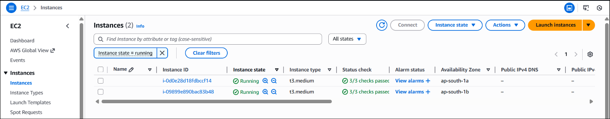
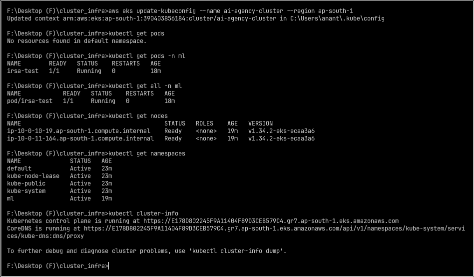

# 1. AWS EKS Infrastructure using Terraform

This repository contains **production-style Infrastructure as Code (IaC)**
for provisioning an **AWS EKS (Elastic Kubernetes Service) cluster**
using **Terraform**, designed specifically to **host and serve fine-tuned
large language models (LLMs)**.

The focus of this project is:
- infrastructure correctness
- modular Terraform design
- real-world AWS patterns for ML/LLM workloads

---

## 2. Project Objectives

1. Provision scalable Kubernetes infrastructure on AWS
2. Follow Terraform best practices using modules
3. Support hosting of fine-tuned LLMs
4. Enable future integration with agent-based systems

---

## 2.1 Position in the Larger System

This repository represents the **infrastructure layer** of a larger,
end-to-end LLM platform composed of multiple independent components:

1. Infrastructure provisioning for hosting fine-tuned LLMs (**this repository**)
2. Fine-tuning base language models using parameter-efficient methods
3. Deploying and serving fine-tuned models on this infrastructure
4. Agent-based applications consuming these models instead of external APIs
   (e.g., OpenAI)

This repository intentionally focuses **only on infrastructure concerns**.
Model training, serving logic, and agent orchestration are handled in
separate repositories to maintain clear separation of responsibilities.

---

## 3. Technology Stack

### 3.1 Tools Used
1. Terraform
2. AWS (EKS, VPC, IAM, EC2)
3. Kubernetes

### 3.2 Why This Stack?
1. Terraform provides declarative, reproducible infrastructure
2. AWS EKS offers a managed Kubernetes control plane
3. Kubernetes is the industry standard for container orchestration
4. This stack aligns well with modern ML and LLM deployment workflows

---

## 4. Proof of Execution

This section provides **verifiable evidence** that the infrastructure
defined in this repository was successfully provisioned and validated.

### 4.1 EKS Cluster Provisioned via Terraform

The following screenshot shows the Amazon EKS cluster successfully
created using Terraform and in an **Active** state.



---

### 4.2 VPC and Networking Resources

The following screenshot shows the VPC and networking components
provisioned as part of the Terraform configuration, including:

- custom VPC
- public and private subnets
- route tables
- NAT gateway
- security groups



---

### 4.3 EKS Worker Nodes (EC2)

The following screenshot shows the EC2 instances backing the EKS
managed node group. All instances are running and have passed
health checks, confirming successful node provisioning.



---

### 4.4 Kubernetes Cluster Verification (kubectl)

The following terminal output demonstrates successful end-to-end
verification of the EKS cluster using `kubectl`:

- kubeconfig updated successfully
- worker nodes in `Ready` state
- namespaces created
- test pod running in a custom namespace
- cluster control plane reachable



---

## 5. Repository Structure


├── main.tf
├── variables.tf
├── outputs.tf
├── backend.tf
├── terraform.tfstate
├── modules/
│   ├── networking/
│   ├── eks/
│   └── security/


---

## 5. Networking Module

### 5.1 Components
1. Virtual Private Cloud (VPC)
2. Public and private subnets
3. Internet Gateway
4. Route tables and associations

### 5.2 Why Custom Networking?
1. Full control over CIDR allocation
2. Better isolation of compute workloads
3. Required for private EKS worker nodes
4. Aligns with AWS security best practices

---

## 6. EKS Module

### 6.1 Components
1. EKS cluster
2. Managed node groups
3. Kubernetes version configuration

### 6.2 Why Managed Node Groups?
1. AWS-managed node lifecycle
2. Simplified upgrades and maintenance
3. Improved reliability over self-managed nodes
4. Better suited for production workloads

---

## 7. Security & IAM Module

### 7.1 Components
1. IAM roles
2. IAM policies
3. IAM Roles for Service Accounts (IRSA)

### 7.2 Why IRSA?
1. Fine-grained, pod-level permissions
2. No long-lived AWS credentials inside containers
3. AWS-recommended approach for Kubernetes security
4. Required for secure access to AWS services from workloads

---

## 8. Terraform State Management

### 8.1 Backend Configuration
- Remote backend (e.g., S3 with DynamoDB locking, if enabled)

### 8.2 Why Remote State?
1. Prevents state corruption
2. Enables collaboration
3. Supports state locking and versioning
4. Required for team-based infrastructure management

---

## 9. Variables & Configuration

### 9.1 Configuration Files
1. `variables.tf`
2. Optional `terraform.tfvars`

### 9.2 Why Parameterization?
1. Environment flexibility (dev / stage / prod)
2. Avoids hard-coded values
3. Cleaner module interfaces
4. Easier reuse across projects

---

## 10. Outputs

### 10.1 Exposed Outputs
1. EKS cluster name
2. Cluster endpoint
3. Node group metadata

### 10.2 Why Outputs Matter?
1. Required for downstream automation
2. Enables integration with CI/CD pipelines
3. Simplifies Kubernetes access configuration

---

## 11. Workflow

1. Initialize Terraform
2. Review the execution plan
3. Apply infrastructure changes
4. Verify EKS cluster creation
5. Connect using `kubectl`

---

## 12. How to Run

```bash
terraform init
terraform plan
terraform apply
